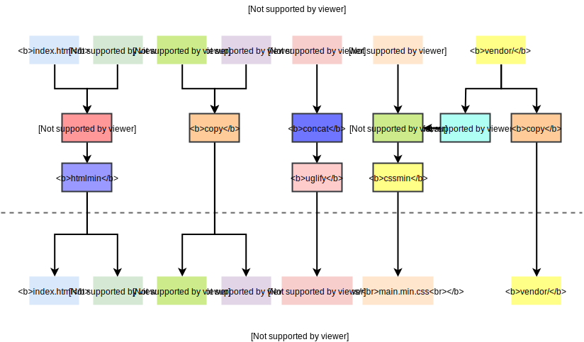

# Gruntfile

My personal [Gruntfile][] for web development. In fact, the main objective of writing this **README** is reminding me of using it instead of helping you how it works :relieved:. Since it's written for myself, the content can be as simple as possible. I find a good excuse for my laziness :)

### Devel

```bash
grunt devel
```

The `devel` task will process files in your work directory and place results in the `build/devel` folder. The mapping as follows:


A frameless rectangle represents a file or a directory which contains files of the same kind, and a rectangle with a border represents a grunt task. The following are short descriptions of tasks shown in the above picture.

- [pug](https://github.com/gruntjs/grunt-contrib-pug): Compile Pug templates
- [copy](https://github.com/gruntjs/grunt-contrib-copy): Copy files and folders
- [sass](https://github.com/gruntjs/grunt-contrib-sass): Compile Sass to CSS
- [google fontface](https://github.com/blinklv/grunt-google-fontface): Fetch CSS files of fonts from Google
- [jshint](https://github.com/gruntjs/grunt-contrib-jshint): Validate files with JSHint
- [responsive image](https://github.com/andismith/grunt-responsive-images): Produce images at different sizes for responsive websites

### Release

```bash
grunt release
```

The `release` task will invoke the `devel` task at first, then process files in the `build/devel` folder and place results in the `build/release` folder. The mapping as follows:



The meaning of the above graph is same as the previous section. I only list short descriptions of tasks haven't shown in the previous section.

- [process html](https://github.com/dciccale/grunt-processhtml): Process html files at build time to modify them depending on the release environment
- [htmlmin](https://github.com/gruntjs/grunt-contrib-htmlmin): Minify HTML
- [concat](https://github.com/gruntjs/grunt-contrib-concat): Concatenate files
- [uglify](https://github.com/gruntjs/grunt-contrib-uglify): Minify files with UglifyJS
- [uncss](https://github.com/uncss/grunt-uncss): A grunt task for removing unused CSS from your projects
- [cssmin](https://github.com/gruntjs/grunt-contrib-cssmin): Compress CSS files
- [relative url replace](https://github.com/gbouthenot/grunt-css-relative-url-replace): Grunt task to replace css urls with relative path

**NOTE**: Although the `release` task will generate the `build/devel` folder, you shouldn't use it because its contents have been polluted. You can use the `rebuild-devel` task to solve this problem.

[Gruntfile]: https://gruntjs.com/sample-gruntfile
