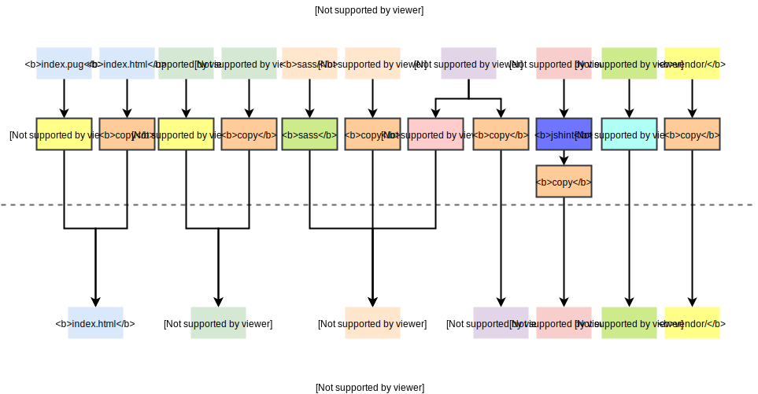

# Gruntfile

My personal [Gruntfile][] for web development. In fact, the main objective of writing this **README** is reminding me of using it instead of helping you how it works :relieved:. Since it's written for myself, the content can be as simple as possible. I find a good excuse for my laziness :)

### Devel

```bash
grunt devel
```

The `devel` task will process files in your work directory and place results in the `build/devel` folder. The mapping as follows:



A frameless rectangle represents a file or a directory which contains files of the same kind, and a rectangle with a border represents a grunt task. The following are short descriptions of tasks shown in the above picture.

- [pug](https://github.com/gruntjs/grunt-contrib-pug): Compile Pug templates
- [copy](https://github.com/gruntjs/grunt-contrib-copy): Copy files and folders
- [sass](https://github.com/gruntjs/grunt-contrib-sass): Compile Sass to CSS
- [google fontface](https://github.com/blinklv/grunt-google-fontface): Fetch CSS files of fonts from Google
- [jshint](https://github.com/gruntjs/grunt-contrib-jshint): Validate files with JSHint
- [responsive image](https://github.com/andismith/grunt-responsive-images): Produce images at different sizes for responsive websites

[Gruntfile]: https://gruntjs.com/sample-gruntfile
